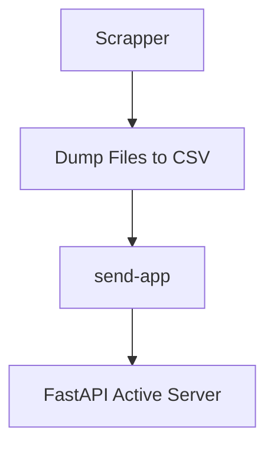

# Task 3

```mermaid
flowchart
Scrapper[Scrapper]
output[Dump Files to CSV]
send-app
FastAPI[FastAPI Active Server]

Scrapper --> output


output --> send-app

send-app --> FastAPI
```

for item in csv_output:
    request.post("", item)

FastAPI
value --> insert