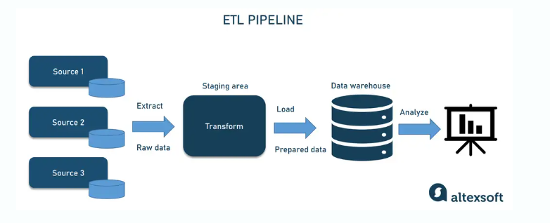

# <!--fit-->Data Engineering
# **By : Daman Regmi**

---
# What is Data Engineering?

* Data engineering involves the processes and techniques used to prepare data for analytical or operational purposes.
* Data engineers build and maintain the infrastructure that allows data to flow seamlessly through systems, ensuring that it is clean, organized, and available for end-users.

---
# Key Responsibilities

- Design and implement data pipelines for efficient data flow.
- Develop and maintain databases and data warehouses.
- Ensure data quality and integrity through validation and cleansing processes.

---
# Key Responsibilities
- Collaborate with data scientists and analysts to understand data requirements.
- Optimize data storage solutions for performance and scalability.

---
# Data Pipeline Architecture

A data pipeline is a series of data processing steps that involve the collection, transformation, and storage of data. The architecture typically includes:
- **Data Sources**: Various origins of data, such as databases, APIs, and flat files.
- **ETL Processes**: Extract, Transform, Load processes that prepare data for analysis.

---
# Data Pipeline Architecture
- **Data Storage**: Systems like data lakes and warehouses that store processed data.
- **Data Access**: Tools and interfaces that allow users to query and analyze data.

---
# Data Pipeline Architecture

---

# Data Quality Management

- **Data Validation**: Checking data for accuracy and completeness.
- **Data Cleansing**: Removing duplicates and correcting errors.
- **Data Profiling**: Analyzing data to understand its structure and quality.
- **Monitoring**: Continuously tracking data quality metrics to identify issues.

---
# <!--fit-->Challenges in Data Engineering
- **Data Silos**: Isolated data sources that hinder integration.
- **Scalability**: Managing increasing volumes of data efficiently.
- **Data Security**: Protecting sensitive information from breaches.
- **Real-time Processing**: Handling data streams in real-time for immediate insights.

---
# Thank You!

